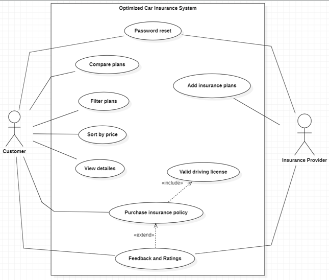
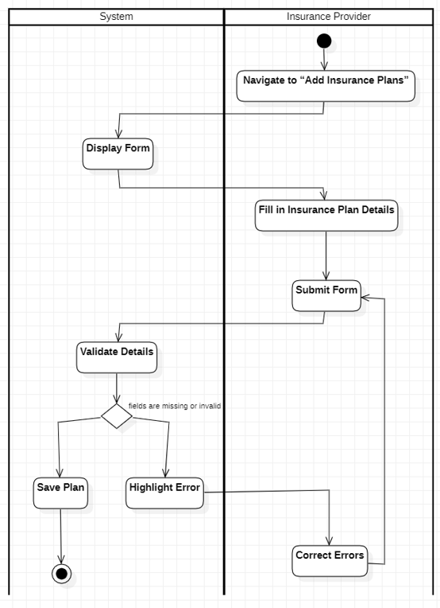
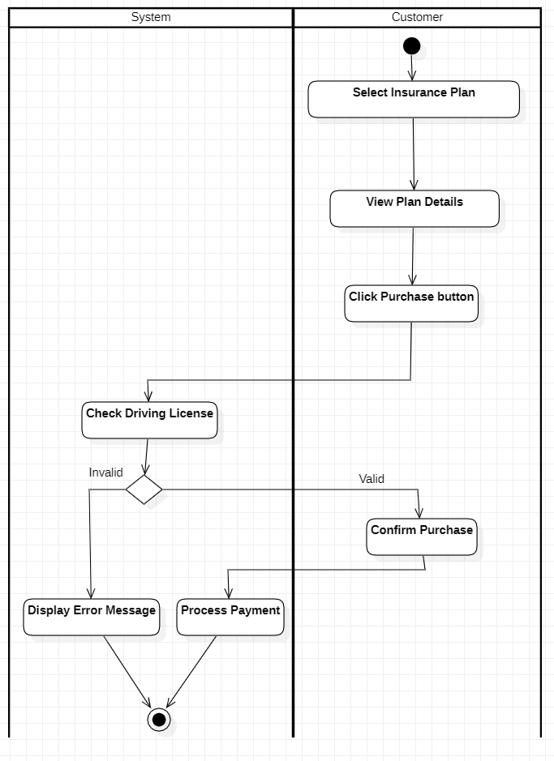
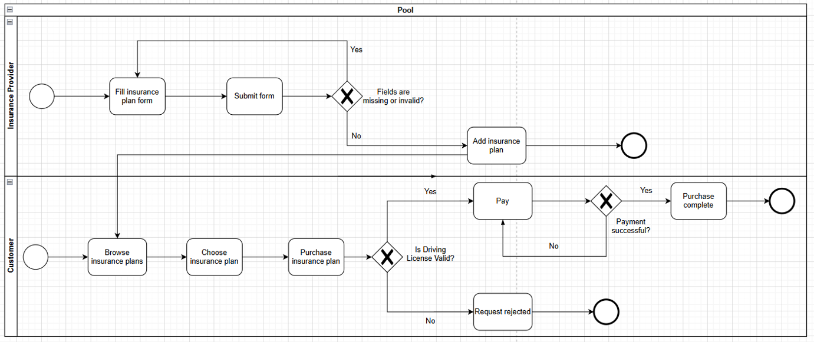
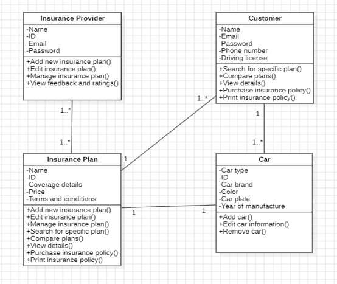
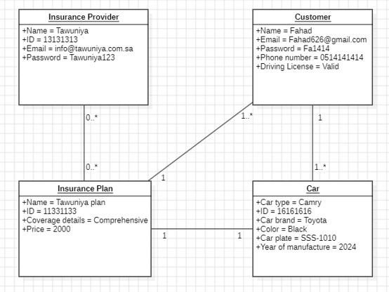
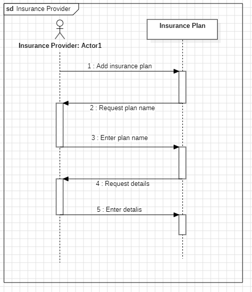
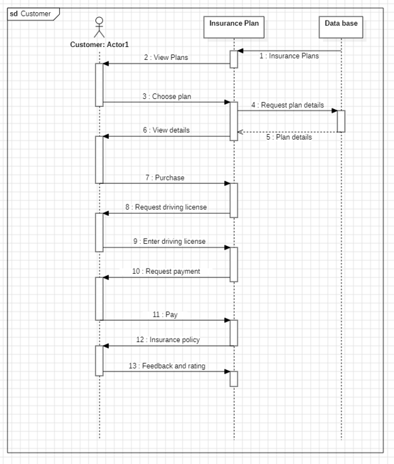
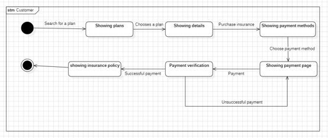
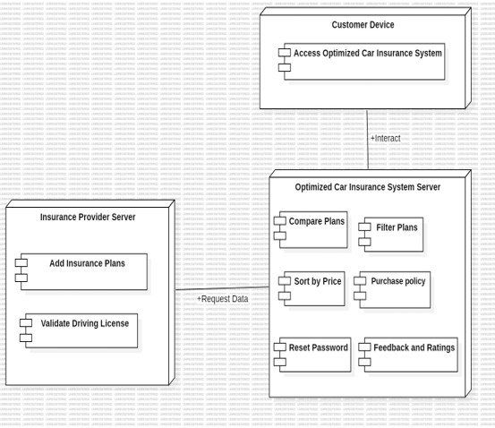

# Optimized Car Insurance System: Analysis & Design

## 📌 Project Overview
The Optimized Car Insurance System is an intermediary digital application designed to connect customers with insurance providers. It addresses the complexity of obtaining insurance by offering a centralized platform where users can comprehend, compare, and select customized policies. For insurance firms, it serves as a management resource to display offerings, engage clients, and expedite applications.

## ⚙️ Development Methodology
The project utilizes the **SDLC Throwaway Prototyping** model. This approach was selected to:
* Gather rapid user feedback and iterate efficiently to resolve client pain points.
* Clarify complex insurance market requirements based on empirical user experience rather than pure speculation.
* Reduce development risks by identifying early design flaws before heavy resource investment.
* Ensure a highly scalable, flexible, and user-centered design that adapts to evolving industry trends.

## 📋 System Requirements

### Functional Requirements
* **Authentication:** Secure sign-up/log-in via email or phone, supported by One-Time Password (OTP) verification and multi-device access.
* **Marketplace Features:** Tools to search, filter (by price and coverage), sort, and compare insurance policies side-by-side.
* **Transactions:** Integrated purchasing system supporting Apple Pay, Visa, and Mada with OTP payment security.
* **Provider Tools:** Dashboards for insurance companies to add, manage, and detail their coverage plans.
* **Engagement:** Built-in customer support (24/7), feedback sections for complaints, and post-purchase policy rating systems.
* **Localization:** Full interface support for both Arabic and English languages.

### Non-Functional Requirements (NFRs)
* **Availability:** Guaranteed 99.9% uptime to provide consistent access for users and providers.
* **Security:** End-to-end encryption for sensitive user data and secure payment processing.
* **Compatibility:** Seamless operation across Android, iOS, and web browsers.
* **Scalability:** Architectural support for high traffic during peak hours and easy integration of new providers as the platform grows.

---

## 📐 System Modeling & UML Architecture

### 1. Functional Modeling

**Use Case Diagrams:** 
Maps critical interactions for Customers (e.g., filter plans, purchase policy, password reset) and Providers (e.g., add insurance plans).

**Activity Diagrams:** 
Visualizes the step-by-step operational workflows.

*Add Insurance Plans Workflow:*

*Purchase Insurance Plan Workflow:*

**BPM (Business Process Modeling):** 
Detailed swimlane modeling of the end-to-end purchasing and plan addition processes.

---

### 2. Structural Modeling

**Class Diagram:** 
Defines core system entities (`Customer`, `Insurance Provider`, `Insurance Plan`, `Car`), detailing their attributes, methods, and relationship multiplicities.

**Object Diagram:** 
Provides snapshots of instantiated objects and documents Class-Responsibility-Collaboration parameters to validate the structural design.

---

### 3. Behavioral Modeling

**Sequence Diagrams:** 
Illustrates the chronological flow of messages between actors and system databases.

*Insurance Provider Sequence:*

*Customer Sequence:*

**State Machine Diagram:** 
Tracks the customer's behavioral lifecycle from searching for a plan, viewing details, selecting a payment method, to final payment verification and policy issuance.

---

## 💻 System Architecture

### Deployment Architecture
The system uses a distributed deployment model separating processing loads:
* **Customer Device:** End-user node for platform access and interaction.
* **Insurance Provider Server:** Handles plan additions and external driving license validation requests.
* **Optimized Car Insurance System Server:** Central node managing core logic including comparison, filtering, purchasing, and feedback.

---
